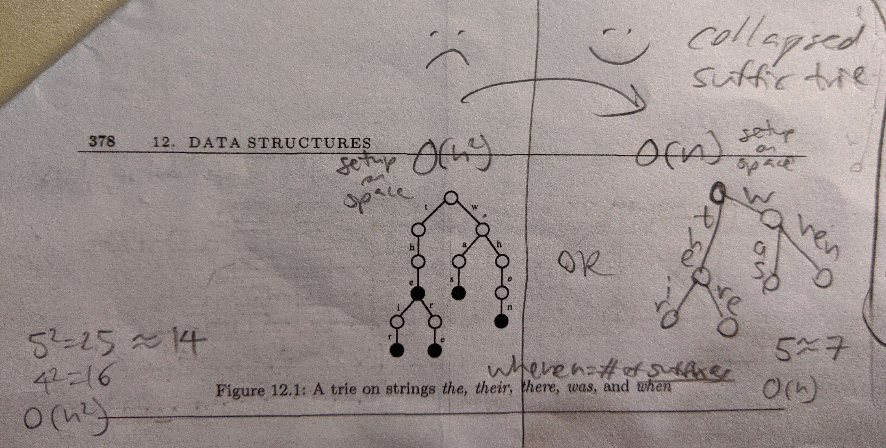
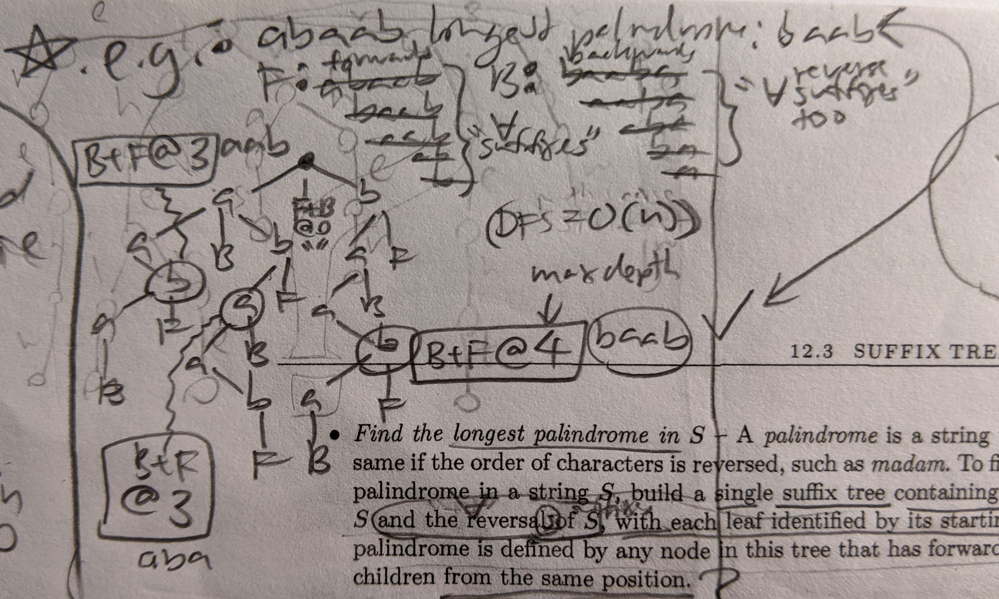

# Learning suffix tree

Just one of the things I'm learning. <https://github.com/hchiam/learning>

Can find all places a substring occurs in a string. Can turn `O(n^2)` into `O(n)` where `n` = # of suffixes.

See the section on suffix trees in ["The Algorithm Design Manual" by Steven Skiena](https://www.algorist.com).

This helped clarify using suffix trees to find longest common substring and longest palindrome: <http://www.cs.jhu.edu/~langmea/resources/lecture_notes/08_suffix_trees_v2.pdf>

Suffix trees can be implemented as tries, collapsed suffix tries, or suffix arrays.

Space for collapsed suffix trie can be further compressed by storing string start+stop indices instead of actually storing the collapsed substring at each node.

Suffix array is typically faster.

## YouTube videos

Manually constructing a suffix tree with DNA nucleotides: https://www.youtube.com/watch?v=VA9m_l6LpwI

Querying string is substring and other uses of suffix tree: https://www.youtube.com/watch?v=A3p6HKfz4Cs
- note that each letter(s) are on edges not on nodes!
- and/so you can "fall off" "partway" along an edge while trying to match!
- is string substring? `Ot(n)` = just going down and finding a valid path
- count the times string is a substring? = count leaves below -> `Ot(k = count of leaves below)` + `Ot(n)` to traverse to the substring = `Ot(k + n)`
- reporting locations/offsets? = read indices stored at leaves below -> `Ot(k + n)` again!
- `Os(m)` where `m` = ???

## Trie vs Collapsed suffix trie

Linear setup time and space: (`O(n)` where `n` = # of suffixes)

## Longest common substring (LCS)

Add all suffixes of both strings:

## Longest palindrome

Add all suffixes of the string, and add all suffixes of the reverse of the string: (compare this with LCS)

