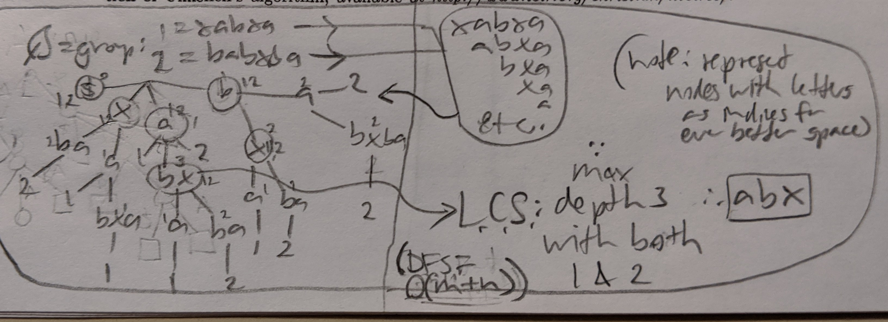

# Learning suffix tree

Just one of the things I'm learning. <https://github.com/hchiam/learning>

Can find all places a substring occurs in a string. Can turn `O(n^2)` into `O(n)` where n = # of suffixes.

See the section on suffix trees in ["The Algorithm Design Manual" by Steven Skiena](https://www.algorist.com).

This helped clarify using suffix trees to find longest common substring and longest palindrome: <http://www.cs.jhu.edu/~langmea/resources/lecture_notes/08_suffix_trees_v2.pdf>

Suffix trees can be implemented as tries, collapsed suffix tries, or suffix arrays.

Space for collapsed suffix trie can be further compressed by storing string start+stop indices instead of actually storing the collapsed substring at each node.

Suffix array is typically faster.

## Trie vs Collapsed suffix trie

<!--  -->

## Longest common substring

<!--  -->

## Longest palindrome

<!--  -->
